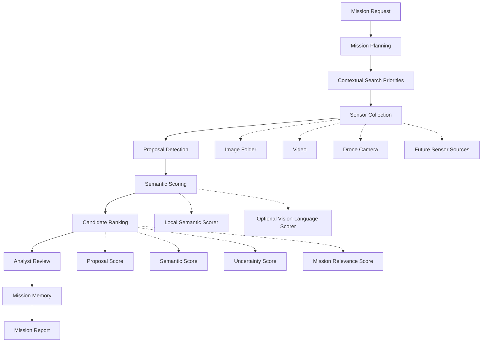
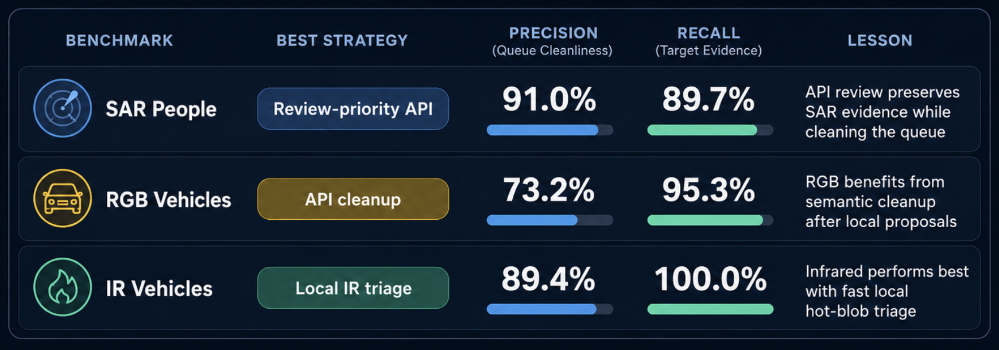
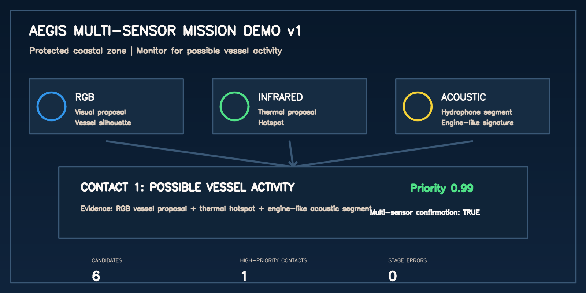

# Mission Intelligence Layer

Mission intelligence platform for robotic and sensor systems.

Mission Intelligence Layer helps operators convert large volumes of sensor data into prioritized findings, analyst decisions, mission memory, and structured mission reports.

The platform combines mission planning, contextual search priorities, proposal detection, semantic analysis, candidate ranking, analyst review, and mission memory into a single workflow. Current validation uses drone simulation, image/video benchmarks, and PX4/Gazebo integration paths, but the architecture is designed to support multiple sensor sources including drones, fixed cameras, robotics platforms, acoustic sensors, telemetry feeds, and recorded datasets.

This repository is for simulation, autonomy workflow development, and perception evaluation. It is not flight-control firmware and should not be connected directly to real motors.

## Aegis Mission Intelligence v1

Current MVP boundary:

| Area | v1 Status |
|---|---|
| Modalities | RGB, infrared, acoustic |
| Outputs | candidates, analyst review, mission memory, mission reports |
| Benchmarks | SAR, RGB vehicles, IR vehicles, acoustic underwater noise |
| Multi-sensor demo | shoreline monitoring |
| System benchmark | five mission-level contact cases |

The v1 product story is simple: Aegis takes RGB imagery, thermal imagery, and hydrophone audio from protected shoreline missions, then produces ranked contacts with supporting evidence across sensors.

## Why This Exists

Modern missions can generate thousands of images, video frames, detections, and sensor observations.

Human operators often have to review that evidence manually. Important findings can be missed while analysts spend time sorting through irrelevant frames, ambiguous detections, or low-quality sensor outputs.

Mission Intelligence Layer focuses on deciding which observations deserve attention while preserving uncertain evidence for review. The goal is not to remove the operator. The goal is to help the operator move faster, miss less, and leave behind a useful mission record.

## System Architecture



PX4, Gazebo, dashboards, cameras, videos, and future sensor feeds are integration points. The mission intelligence layer is the product.

Low-level vehicle control stays separated from mission reasoning. Perception scoring does not directly control a vehicle; it produces reviewable evidence and mission reports.

## Benchmark Snapshot

| Benchmark | Best Current Strategy | Capture Precision | Capture Recall |
|---|---|---:|---:|
| SAR People | review-priority API | 91.0% | 89.7% |
| RGB Vehicles | API cleanup | 73.2% | 95.3% |
| IR Vehicles | local IR triage | 89.4% | 100.0% |
| Acoustic v1 | anthropogenic acoustic triage | 70.4% | 95.0% |
| System Benchmark v1 | multi-sensor mission workflow | 100.0% | 100.0% |



The headline lesson: review policy should depend on modality. RGB vehicle evidence benefits from semantic cleanup after local proposals; infrared vehicle evidence currently performs best with local hot-blob triage.

Measurement note: capture recall is measured after full-frame fallback. When no local proposal is found, the whole frame is preserved as a low-confidence candidate for review, so capture recall is intentionally biased high and capture precision reflects the resulting review cost. Read 100% capture recall as "no target was silently dropped before analyst review," not as detector accuracy.

The acoustic benchmark now has a measured before/after result. The first baseline run reached 23.7% precision and 45.0% recall; after adding anthropogenic acoustic triage, Aegis reaches 70.4% precision and 95.0% recall on the same 60 underwater-noise clips.

## Multi-Sensor Shoreline Demo

Aegis now includes a small maritime monitoring demo that combines visual, infrared, and acoustic evidence into one mission workflow.

Scenario:

```text
Protected coastal zone.
Mission: monitor for possible vessel activity.
Inputs: RGB shoreline image, thermal shoreline image, hydrophone recording.
Output: unified contacts, evidence by modality, analyst review queue, mission report.
```

Example result from the demo run:

| Output | Result |
|---|---:|
| Candidates generated | 6 |
| High-priority contacts | 1 |
| Stage errors | 0 |
| Multi-sensor confirmation | true |

The highest-priority contact combined RGB, infrared, and acoustic evidence: a visual vessel-like proposal, a thermal hotspot, and an engine-like acoustic segment.



Run it with:

```bash
./scripts/run_multisensor_demo.sh \
  --mission-request "Monitor a protected shoreline for possible vessel activity" \
  --rgb-images demo_data/shoreline_v1/rgb \
  --ir-images demo_data/shoreline_v1/ir \
  --acoustic demo_data/shoreline_v1/acoustic/hydrophone_contact_001.wav \
  --output-dir logs/multisensor_missions
```

## Core Concepts

**Mission Planning**
Converts plain-English objectives into structured mission commands, operating modes, target descriptions, confirmation policies, and link-loss behavior.

**Contextual Search Priorities**
Infers likely places to search first based on mission context. A vehicle mission, person search, vessel search, debris search, and signal search should not all be treated as the same generic grid problem.

**Proposal Detection**
Uses lightweight local detection to find candidate regions before heavier semantic review. Current proposal layers include color-based detection, high-recall detection, and objectness-style proposals.

**Semantic Scoring**
Scores candidate crops and full frames against the mission request. The system supports a local semantic scorer and an optional OpenAI-backed vision scorer for stronger open-vocabulary review.

**Candidate Ranking**
Separates confirmed matches from review preservation. A likely match ranks high, uncertain evidence stays reviewable, scorer failures remain visible, and rejected crops can trigger full-frame review.

Each candidate receives an explicit ranking object:

```json
{
  "proposal_score": 0.81,
  "semantic_score": 0.67,
  "uncertainty_score": 0.43,
  "mission_relevance_score": 0.74,
  "review_priority": 0.72
}
```

The analyst queue is sorted by `review_priority`.

**Analyst Review**
Provides a human decision layer for approving, rejecting, or investigating candidates. Review decisions are saved beside mission reports.

**Mission Memory**
Summarizes previous reports and analyst decisions to expose recurring false positives, recurring misses, weak categories, and recommended benchmark data to collect next.

**Mission Reports**
Generates structured JSON and HTML reports covering mission understanding, contextual planning, vision strategy, candidate results, metrics, and stage health.

## System Principles

**Human In The Loop**
The platform assists operators. It does not remove oversight from high-stakes search, rescue, inspection, or security workflows.

**Resilient By Design**
No single component should erase the mission.

- Detector fails -> preserve the frame and continue reporting.
- Crop is wrong -> run full-frame semantic review.
- Semantic scorer times out -> keep the candidate for review.
- Dashboard fails -> reports and review files remain on disk.
- Benchmark fails on one mission -> the suite records the error and continues.

The preferred failure mode is degraded confidence and more review, not silent misses.

**Mission Intelligence Before Drone Simulation**
The drone simulator is a validation platform. The broader system is a reusable mission intelligence layer for robotic and sensor workflows.

## Example Workflow

```text
Mission: Search for a missing person near a shoreline
  -> Mission planner extracts target, urgency, context, and operating mode
  -> Context planner prioritizes likely locations
  -> Sensor source provides imagery or video
  -> Proposal detector generates candidate observations
  -> Semantic scorer reviews crops and full frames
  -> Candidate ranking sorts the analyst queue
  -> Analyst approves, rejects, or investigates findings
  -> Mission report is generated
  -> Mission memory records patterns and weaknesses
```

## Current Capabilities

- Plain-English mission objective parsing
- Mission command generation with operating modes
- Contextual search priority planning
- Search mission state machines for simulated robotic workflows
- PX4/Gazebo helper scripts for drone-based validation
- Fast dashboard simulation for command, telemetry, alerts, and logs
- Image and video mission evaluation
- Vision benchmark suite across mission types
- Color, high-recall, objectness, vehicle, and optional YOLO proposal detection
- Local semantic scoring interface
- Optional local CLIP open-vocabulary semantic scoring (offline, `pip install '.[ml]'`, see `docs/LEARNED_MODELS.md`)
- Optional OpenAI vision-language scoring backend
- Full-frame fallback review for detector misses and rejected crops
- IoU-based localization metrics (precision/recall/F1, mean IoU, AP) alongside capture metrics via a `gt_boxes` labels column
- Multi-frame contact tracking for video missions (one contact per track, not per frame)
- Pixel-to-ground georeferencing for camera detections (NED + lat/lon)
- Candidate ranking with review-priority explanations
- Analyst dashboard for reviewing candidates, metrics, reports, and mission memory
- Mission memory summaries from past reports and analyst decisions
- JSON and HTML mission reports
- Structured logs, debug images, candidate crops, and review files
- Safety-oriented mission concepts: return-home, geofence, abort, manual override, and link-loss policy

## Analyst Dashboard

Run:

```bash
./scripts/run_analyst_dashboard.sh
```

Open:

```text
http://localhost:8010
```

The dashboard provides:

- saved mission and vision reports
- mission planning from a plain-English request
- candidate queue and shortlist review
- confidence scores and review-priority reasons
- precision, recall, F1, and capture-recall metrics
- approve, reject, and investigate review states
- mission memory from previous reports and analyst decisions

Review decisions are saved beside each report:

```text
candidate_reviews.json
```

Example decision record:

```json
{
  "candidate_id": "0042_shoreline_frame",
  "decision": "reject",
  "reason": "shoreline debris",
  "notes": "Bright clutter, no vessel structure visible",
  "updated_at": "2026-06-05T12:00:00Z"
}
```

## Benchmarking

The benchmark suite evaluates the system across mission contexts and sensor modalities, not just one detector task.

| Benchmark | Images | Review Strategy | Capture Precision | Capture Recall |
|---|---:|---|---:|---:|
| SAR local triage | 5,712 | local full-dataset pass | 83.7% | 69.8% |
| SAR API review | 200 | review-priority sample | 91.0% | 89.7% |
| Vehicle local triage | 43 | local category baseline | 34.6% | 81.8% |
| DroneVehicle RGB local subset | 500 | local vehicle proposals | 50.0% | 100.0% |
| DroneVehicle RGB API review | 100 | review-priority sample | 73.2% | 95.3% |
| DroneVehicle IR local subset | 500 | local vehicle proposals | 89.4% | 100.0% |
| DroneVehicle IR API review | 100 | review-priority sample | 61.1% | 100.0% |

Recent benchmark direction:

- full-frame fallback significantly improved target capture
- review-priority API sampling improved SAR people search
- RGB vehicle evidence benefits from semantic API cleanup
- IR vehicle evidence currently performs best with local hot-blob triage
- thermal API review needs stricter prompting or a stricter `NEEDS_REVIEW` threshold

Detailed benchmark reports and commands:

```text
docs/RUNNING_BENCHMARKS.md
docs/AEGIS_MISSION_INTELLIGENCE_V1.md
docs/ACOUSTIC_INTELLIGENCE_ROADMAP.md
docs/ACOUSTIC_BENCHMARK_V1_SNIPPET.md
docs/ACOUSTIC_BENCHMARK_TUNING_REPORT.md
docs/MULTISENSOR_SHORELINE_DEMO.md
docs/SYSTEM_BENCHMARK_V1_REPORT.md
docs/SARD_BENCHMARK_REPORT.md
docs/VEHICLE_BENCHMARK_REPORT.md
docs/DRONEVEHICLE_BENCHMARK_ANALYSIS.md
docs/DRONEVEHICLE_RGB_BENCHMARK_REPORT.md
docs/DRONEVEHICLE_IR_BENCHMARK_REPORT.md
docs/DRONEVEHICLE_RGB_API_BENCHMARK_REPORT.md
docs/DRONEVEHICLE_IR_API_BENCHMARK_REPORT.md
docs/LINKEDIN_POST_AEGIS_VEHICLE_MODALITY_BENCHMARK.md
docs/PORTFOLIO_AEGIS_MODALITY_INTELLIGENCE.md
```

Next platform expansion:

```text
Aegis Vision Intelligence
+ Aegis Infrared Intelligence
+ Aegis Acoustic Intelligence
```

The vehicle modality benchmark makes acoustic/sonar sensing the next logical expansion: a non-visual evidence stream that can use the same mission-memory, benchmark, and analyst-review workflow.

Phase 1/2 acoustic evidence support now includes `.wav` ingestion, spectrogram generation, high-energy and anthropogenic acoustic proposals, candidate JSON, and a simple acoustic report.

The analyst dashboard can review acoustic candidates with spectrograms, time ranges, proposal scores, reasons, review priority, and approve/reject/investigate decisions.

The first multi-sensor demo runner combines one RGB image set, one IR image set, and one acoustic recording into a unified candidate list and mission report.

## Mission Memory

Mission memory reads past reports and analyst review decisions to summarize what the platform is learning operationally.

Example shape:

```json
{
  "recurring_false_positives": ["grass", "grey objects", "white vehicles"],
  "recurring_misses": ["partially hidden person", "small distant vehicle"],
  "common_false_positive_causes": ["vegetation", "shadow", "debris"],
  "common_uncertainty_causes": ["too small"],
  "sensor_modality_lessons": [
    "RGB vehicle evidence benefits from selective API semantic review.",
    "Infrared vehicle evidence currently performs better with local hot-blob triage."
  ],
  "weak_categories": ["boats", "smoke", "signals"],
  "recommended_data": ["shoreline vessel imagery", "hard-negative smoke/fog examples"]
}
```

This is not model training yet. It is operational learning: the system records where it is weak, what it tends to over-prioritize, which analyst reason tags keep appearing, and what benchmark data should be collected next.

## Mission Evaluation

Run the full mission-intelligence loop over image or video evidence:

```bash
./scripts/run_mission_evaluation.sh "/path/to/images" \
  --mission-request "Search the shoreline for a missing person wearing an orange life vest" \
  --labels-csv "/path/to/labels.csv"
```

The report combines mission command parsing, contextual search priorities, vision planning, candidate detection, semantic scoring, evaluation metrics, and stage health.

Each mission report includes:

- mission objective
- search area
- evidence collected
- candidates found
- analyst decisions
- performance metrics
- mission memory
- recommendations

Detailed local/API benchmark commands are in [docs/RUNNING_BENCHMARKS.md](docs/RUNNING_BENCHMARKS.md).

## Optional Vision-Language Scoring

The local semantic scorer is intentionally conservative. It ranks candidates but does not claim exact arbitrary object recognition. For stronger open-vocabulary testing, the project supports an optional OpenAI-backed vision scorer. Setup and benchmark commands are documented in [docs/RUNNING_BENCHMARKS.md](docs/RUNNING_BENCHMARKS.md).

## Simulation And Drone Validation

The lightweight dashboard simulation:

```bash
python3 server.py
```

Open:

```text
http://localhost:8000
```

PX4 remains responsible for low-level stabilization and flight control. Mission logic should call controller interfaces, not publish raw flight-control messages directly.

PX4/Gazebo setup details live in [docs/PX4_GAZEBO_SETUP.md](docs/PX4_GAZEBO_SETUP.md).

## Technology Stack

- Python
- OpenCV
- HTML/CSS/JavaScript dashboard
- JSON/CSV mission logs and reports
- PX4/Gazebo validation path
- ROS 2 integration path
- Optional OpenAI vision-language scoring

Core modules live in `autonomy/`:

- `mission_command.py`: mission command and operating-mode policy
- `mission_objective.py`: plain-English objective parsing
- `contextual_search_plan.py`: contextual priority planning
- `mission_vision_plan.py`: mission-specific perception plan
- `vision_lab.py`: image/video benchmark runner
- `semantic_vision.py`: semantic scoring interface
- `mission_evaluation.py`: full mission evaluation pipeline
- `mission_benchmark_suite.py`: benchmark suite runner
- `mission_memory.py`: report and analyst-review memory
- `acoustic_intelligence.py`: WAV ingestion, spectrograms, acoustic proposals, and reports
- `multisensor_mission_demo.py`: RGB, IR, and acoustic mission demo report
- `world_model.py`: local grid map of searched cells, candidates, and confidence
- `px4_controller_interface.py`: ROS 2/PX4 Offboard wrapper

## Tests

Run the main mission-intelligence checks:

```bash
python3 tests/test_mission_memory.py
python3 tests/test_mission_evaluation.py
python3 tests/test_vehicle_proposal_layer.py
python3 tests/test_multisensor_mission_demo.py
```

## Roadmap

Recently completed:

- IoU localization metrics (`autonomy/detection_metrics.py`) reported alongside capture metrics
- multi-frame contact tracking for video missions (`autonomy/contact_tracker.py`)
- local CLIP semantic scorer and YOLO proposal detector as optional `[ml]` extras (`docs/LEARNED_MODELS.md`)
- pixel-to-ground georeferencing (`autonomy/georeference.py`)
- closed-loop PX4/Gazebo runbook and chained launcher (`docs/CLOSED_LOOP_DEMO_RUNBOOK.md`, `scripts/run_closed_loop_demo.sh`)

Near-term:

- record the demo video (`docs/DEMO_VIDEO_PLAN.md`) and add a dashboard screenshot to this README
- collect broader labeled datasets for boats, debris, signals, fire/smoke, structure damage, and animals
- improve candidate ranking to reduce noisy review items while preserving capture recall
- improve analyst review workflow and report browsing
- keep expanding mission memory into practical recommendations
- wire georeferenced contact locations into live search missions and the dashboard

Medium-term:

- rename the repository to `mission-intelligence-layer`
- add cleaner sensor abstraction for folders, videos, live cameras, drone cameras, and future acoustic sources
- support disconnected/edge collection with host-side semantic review after reconnect or return
- add richer report export for portfolio/demo use

Architecture details and longer-term dataset priorities are tracked in:

```text
docs/MISSION_INTELLIGENCE_ROADMAP.md
```

## Safety

This project is simulation-first. For any future hardware work, start with bench tests, props-off tests, tethered hover, manual flight, assisted waypoint flight, and only then controlled autonomous tests in a legal area with permission.

Keep human override, logging, geofencing, and return-home behavior in the loop.
